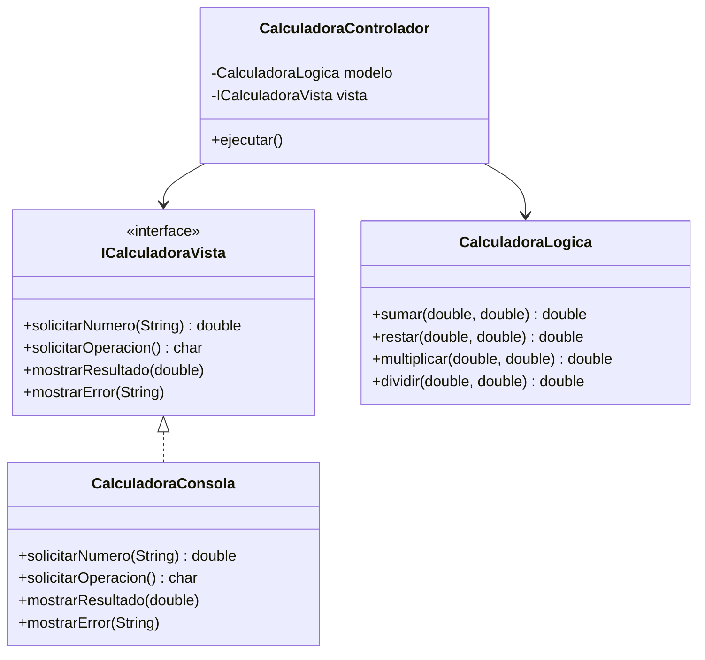
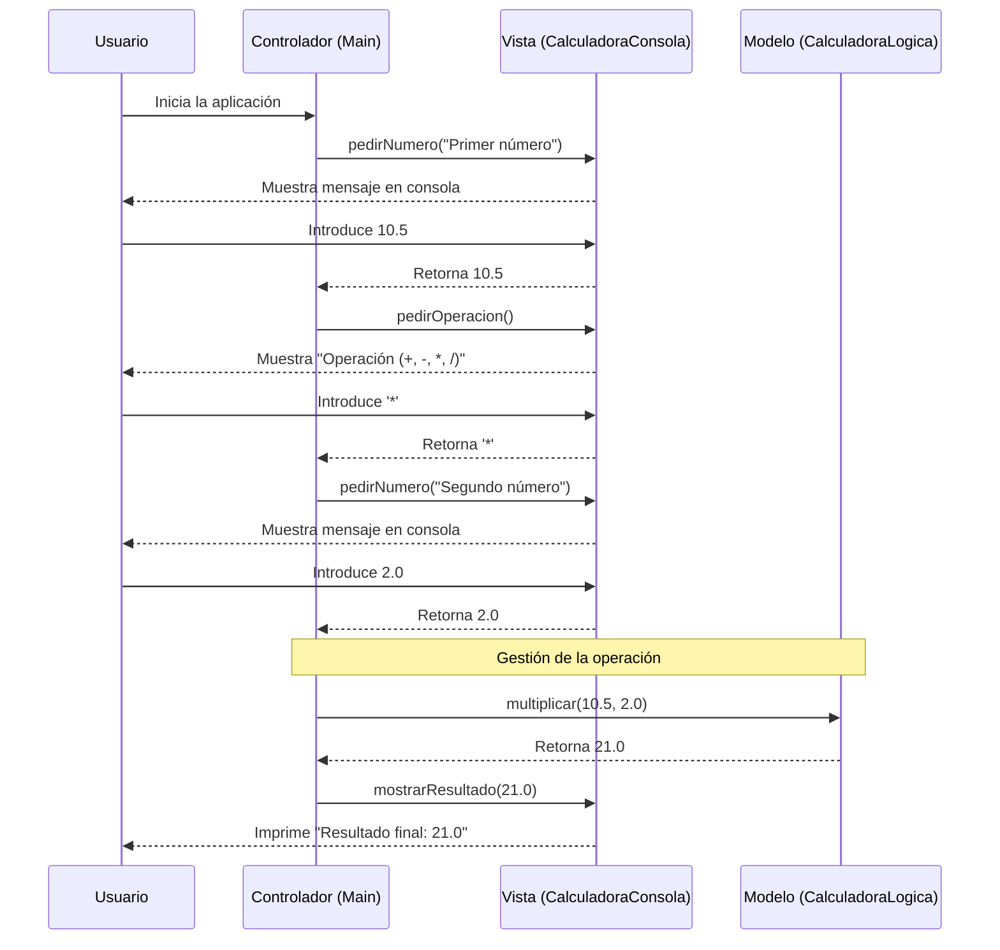
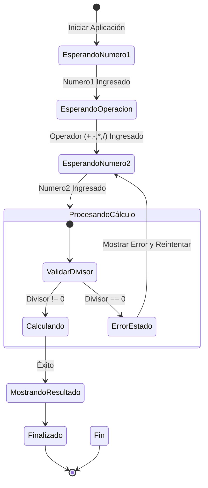

## Diagrama de clases

```mermaid
classDiagram
    class ICalculadoraVista {
        <<interface>>
        +solicitarNumero(String) double
        +solicitarOperacion() char
        +mostrarResultado(double)
        +mostrarError(String)
    }
    class CalculadoraConsola {
        +solicitarNumero(String) double
        +solicitarOperacion() char
        +mostrarResultado(double)
        +mostrarError(String)
    }
    class CalculadoraLogica {
        +sumar(double, double) double
        +restar(double, double) double
        +multiplicar(double, double) double
        +dividir(double, double) double
    }
    class CalculadoraControlador {
        -CalculadoraLogica modelo
        -ICalculadoraVista vista
        +ejecutar()
    }

    ICalculadoraVista <|.. CalculadoraConsola
    CalculadoraControlador --> ICalculadoraVista
    CalculadoraControlador --> CalculadoraLogica
```

## Diagrama de secuencia Calculadora sencilla

```mermaid
sequenceDiagram
    participant U as Usuario
    participant C as Controlador (Main)
    participant V as Vista (CalculadoraConsola)
    participant M as Modelo (CalculadoraLogica)

    U->>C: Inicia la aplicación
    C->>V: pedirNumero("Primer número")
    V-->>U: Muestra mensaje en consola
    U->>V: Introduce 10.5
    V-->>C: Retorna 10.5

    C->>V: pedirOperacion()
    V-->>U: Muestra "Operación (+, -, *, /)"
    U->>V: Introduce '*'
    V-->>C: Retorna '*'

    C->>V: pedirNumero("Segundo número")
    V-->>U: Muestra mensaje en consola
    U->>V: Introduce 2.0
    V-->>C: Retorna 2.0

    Note over C,M: Gestión de la operación
    C->>M: multiplicar(10.5, 2.0)
    M-->>C: Retorna 21.0

    C->>V: mostrarResultado(21.0)
    V-->>U: Imprime "Resultado final: 21.0"
```

## Diagrama de estados Calculadora sencilla

```mermaid
stateDiagram-v2
    [*] --> EsperandoNumero1: Iniciar Aplicación
    
    EsperandoNumero1 --> EsperandoOperacion: Numero1 Ingresado
    
    EsperandoOperacion --> EsperandoNumero2: Operador (+,-,*,/) Ingresado
    
    EsperandoNumero2 --> ProcesandoCálculo: Numero2 Ingresado
    
    state ProcesandoCálculo {
        [*] --> ValidarDivisor
        ValidarDivisor --> Calculando: Divisor != 0
        ValidarDivisor --> ErrorEstado: Divisor == 0
    }
    
    Calculando --> MostrandoResultado: Éxito
    ErrorEstado --> EsperandoNumero2: Mostrar Error y Reintentar
    
    MostrandoResultado --> Finalizado
    Finalizado --> [*]
Fin --> [*]
```
