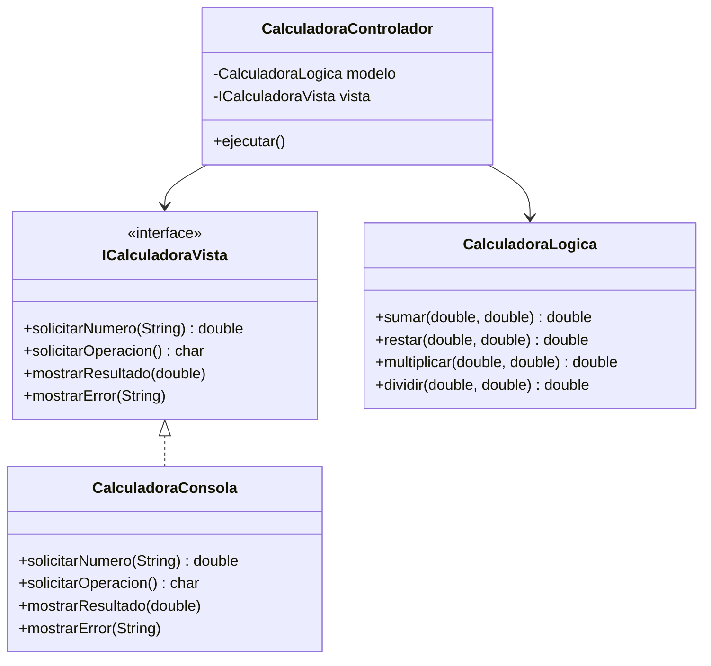

## UML_Draw_io

```mermaid
classDiagram
    class ICalculadoraVista {
        <<interface>>
        +solicitarNumero(String) double
        +solicitarOperacion() char
        +mostrarResultado(double)
        +mostrarError(String)
    }
    class CalculadoraConsola {
        +solicitarNumero(String) double
        +solicitarOperacion() char
        +mostrarResultado(double)
        +mostrarError(String)
    }
    class CalculadoraLogica {
        +sumar(double, double) double
        +restar(double, double) double
        +multiplicar(double, double) double
        +dividir(double, double) double
    }
    class CalculadoraControlador {
        -CalculadoraLogica modelo
        -ICalculadoraVista vista
        +ejecutar()
    }

    ICalculadoraVista <|.. CalculadoraConsola
    CalculadoraControlador --> ICalculadoraVista
    CalculadoraControlador --> CalculadoraLogica
```
