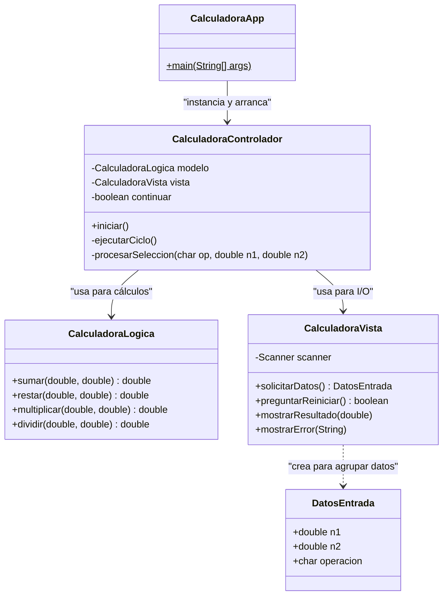
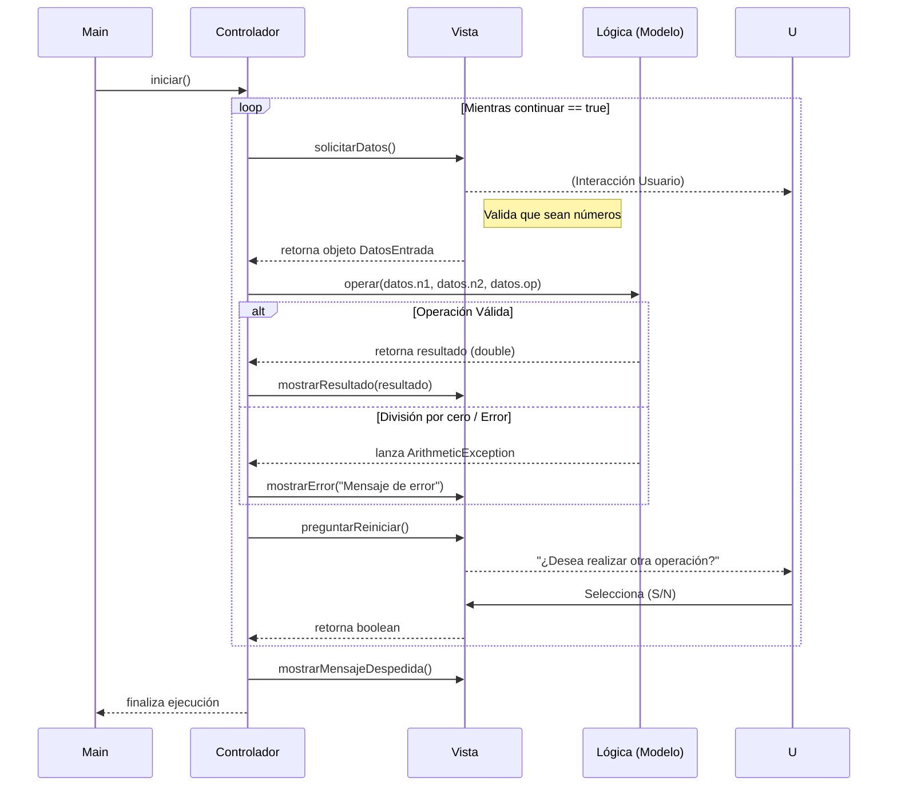
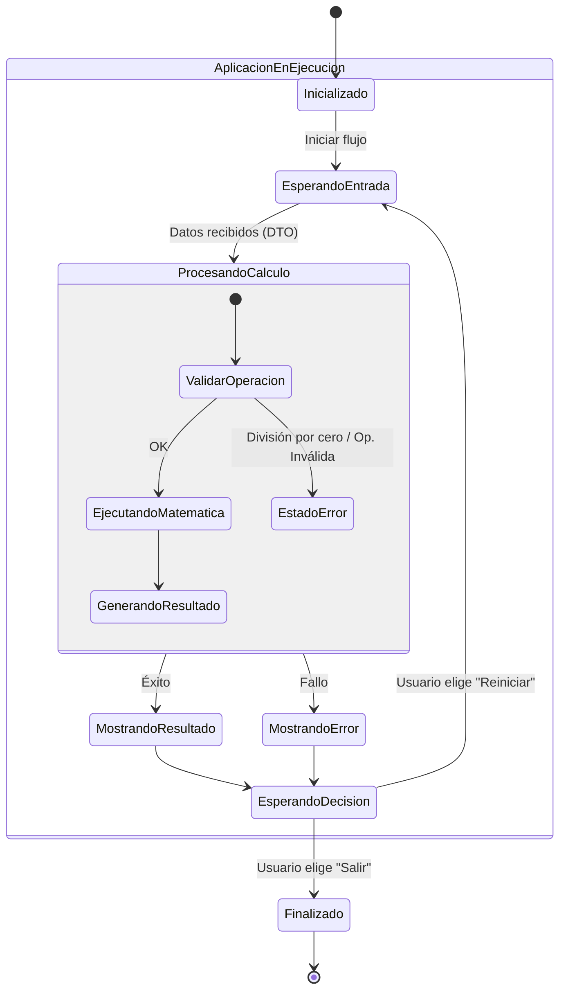
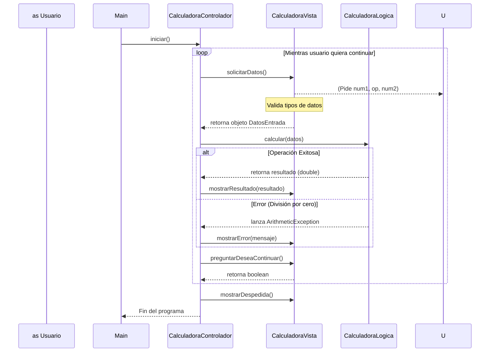
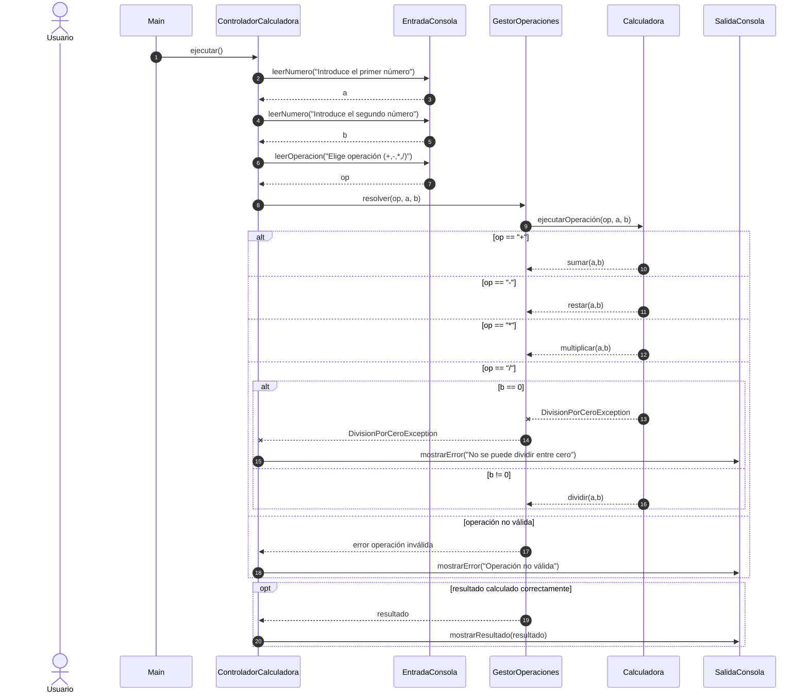
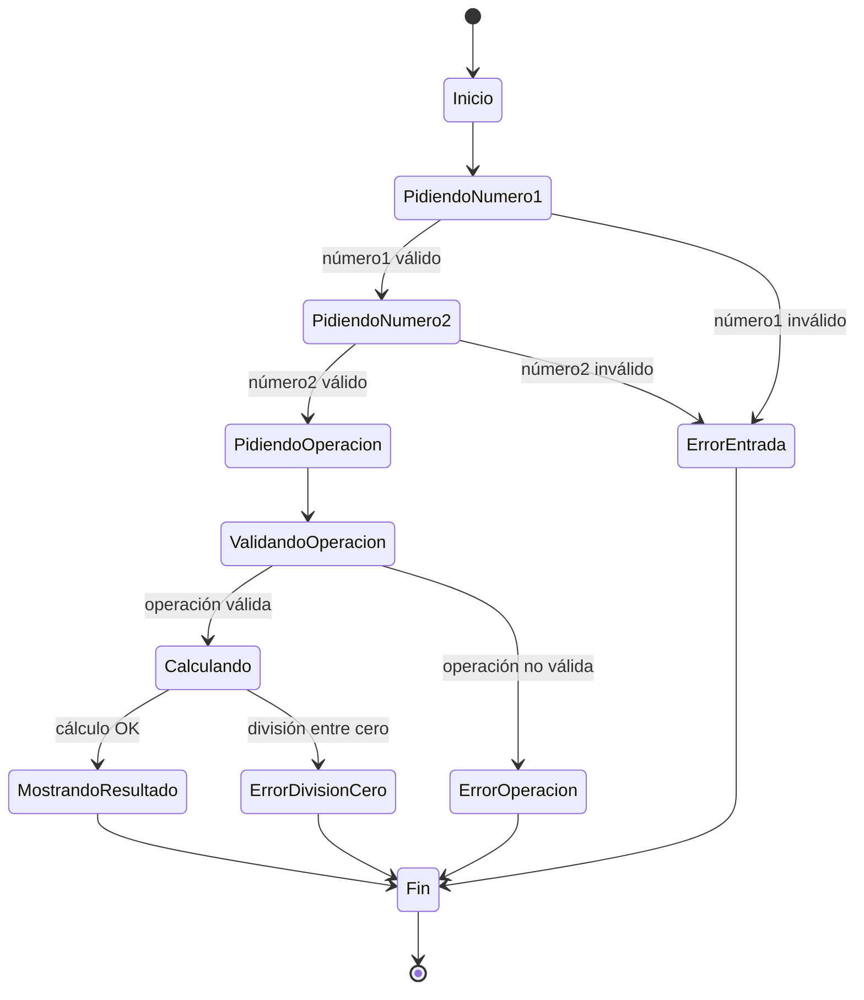

## Diagrama de clases

```mermaid
classDiagram
    class CalculadoraApp {
        +main(String[] args)$
    }

    class CalculadoraControlador {
        -CalculadoraLogica modelo
        -CalculadoraVista vista
        -boolean continuar
        +iniciar()
        -ejecutarCiclo()
        -procesarSeleccion(char op, double n1, double n2)
    }

    class CalculadoraLogica {
        +sumar(double, double) double
        +restar(double, double) double
        +multiplicar(double, double) double
        +dividir(double, double) double
    }

    class CalculadoraVista {
        -Scanner scanner
        +solicitarDatos() DatosEntrada
        +preguntarReiniciar() boolean
        +mostrarResultado(double)
        +mostrarError(String)
    }

    class DatosEntrada {
        +double n1
        +double n2
        +char operacion
    }

    CalculadoraApp --> CalculadoraControlador : "instancia y arranca"
    CalculadoraControlador --> CalculadoraLogica : "usa para cálculos"
    CalculadoraControlador --> CalculadoraVista : "usa para I/O"
    CalculadoraVista ..> DatosEntrada : "crea para agrupar datos"
```

## Diagrama de secuencia

```mermaid

sequenceDiagram
    participant App as Main
    participant C as Controlador
    participant V as Vista
    participant M as Lógica (Modelo)

    App->>C: iniciar()
    
    loop Mientras continuar == true
        C->>V: solicitarDatos()
        V-->>U: (Interacción Usuario)
        Note right of V: Valida que sean números
        V-->>C: retorna objeto DatosEntrada
        
        C->>M: operar(datos.n1, datos.n2, datos.op)
        alt Operación Válida
            M-->>C: retorna resultado (double)
            C->>V: mostrarResultado(resultado)
        else División por cero / Error
            M-->>C: lanza ArithmeticException
            C->>V: mostrarError("Mensaje de error")
        end
        
        C->>V: preguntarReiniciar()
        V-->>U: "¿Desea realizar otra operación?"
        U->>V: Selecciona (S/N)
        V-->>C: retorna boolean
    end
    
    C->>V: mostrarMensajeDespedida()
    C-->>App: finaliza ejecución
```

## Diagrama de estados

```mermaid
stateDiagram-v2
    [*] --> Inicializado
    
    state AplicacionEnEjecucion {
        Inicializado --> EsperandoEntrada: Iniciar flujo
        
        EsperandoEntrada --> ProcesandoCalculo: Datos recibidos (DTO)
        
        state ProcesandoCalculo {
            [*] --> ValidarOperacion
            ValidarOperacion --> EjecutandoMatematica: OK
            ValidarOperacion --> EstadoError: División por cero / Op. Inválida
            EjecutandoMatematica --> GenerandoResultado
        }
        
        ProcesandoCalculo --> MostrandoResultado: Éxito
        ProcesandoCalculo --> MostrandoError: Fallo
        
        MostrandoResultado --> EsperandoDecision
        MostrandoError --> EsperandoDecision
        
        EsperandoDecision --> EsperandoEntrada: Usuario elige "Reiniciar"
    }
    
    EsperandoDecision --> Finalizado: Usuario elige "Salir"
    Finalizado --> [*]
```

## Diagrama de secuencia del programa

```mermaid
sequenceDiagram
    participant as Usuario
    participant M as Main
    participant C as CalculadoraControlador
    participant V as CalculadoraVista
    participant L as CalculadoraLogica

    M->>C: iniciar()
    
    loop Mientras usuario quiera continuar
        C->>V: solicitarDatos()
        V-->>U: (Pide num1, op, num2)
        Note over V: Valida tipos de datos
        V-->>C: retorna objeto DatosEntrada
        
        C->>L: calcular(datos)
        alt Operación Exitosa
            L-->>C: retorna resultado (double)
            C->>V: mostrarResultado(resultado)
        else Error (División por cero)
            L-->>C: lanza ArithmeticException
            C->>V: mostrarError(mensaje)
        end
        
        C->>V: preguntarDeseaContinuar()
        V-->>C: retorna boolean
    end
    
    C->>V: mostrarDespedida()
    C-->>M: Fin del programa
```

## Diagrama de secuencia del programa, con usuario

```mermaid
sequenceDiagram
autonumber

actor Usuario
participant Main
participant Controlador as ControladorCalculadora
participant Entrada as EntradaConsola
participant Gestor as GestorOperaciones
participant Calc as Calculadora
participant Salida as SalidaConsola

Main->>Controlador: ejecutar()

Controlador->>Entrada: leerNumero("Introduce el primer número")
Entrada-->>Controlador: a

Controlador->>Entrada: leerNumero("Introduce el segundo número")
Entrada-->>Controlador: b

Controlador->>Entrada: leerOperacion("Elige operación (+,-,*,/)")
Entrada-->>Controlador: op

Controlador->>Gestor: resolver(op, a, b)
Gestor->>Calc: ejecutarOperación(op, a, b)

alt op == "+"
  Calc-->>Gestor: sumar(a,b)
else op == "-"
  Calc-->>Gestor: restar(a,b)
else op == "*"
  Calc-->>Gestor: multiplicar(a,b)
else op == "/"
  alt b == 0
    Calc--x Gestor: DivisionPorCeroException
    Gestor--x Controlador: DivisionPorCeroException
    Controlador->>Salida: mostrarError("No se puede dividir entre cero")
  else b != 0
    Calc-->>Gestor: dividir(a,b)
  end
else operación no válida
  Gestor-->>Controlador: error operación inválida
  Controlador->>Salida: mostrarError("Operación no válida")
end

opt resultado calculado correctamente
  Gestor-->>Controlador: resultado
  Controlador->>Salida: mostrarResultado(resultado)
end
```
## Diagrama de estados

```mermaid
stateDiagram-v2
[*] --> Inicio

Inicio --> PidiendoNumero1
PidiendoNumero1 --> PidiendoNumero2 : número1 válido
PidiendoNumero1 --> ErrorEntrada : número1 inválido

PidiendoNumero2 --> PidiendoOperacion : número2 válido
PidiendoNumero2 --> ErrorEntrada : número2 inválido

PidiendoOperacion --> ValidandoOperacion
ValidandoOperacion --> Calculando : operación válida
ValidandoOperacion --> ErrorOperacion : operación no válida

Calculando --> MostrandoResultado : cálculo OK
Calculando --> ErrorDivisionCero : división entre cero

MostrandoResultado --> Fin
ErrorEntrada --> Fin
ErrorOperacion --> Fin
ErrorDivisionCero --> Fin

Fin --> [*]

```
